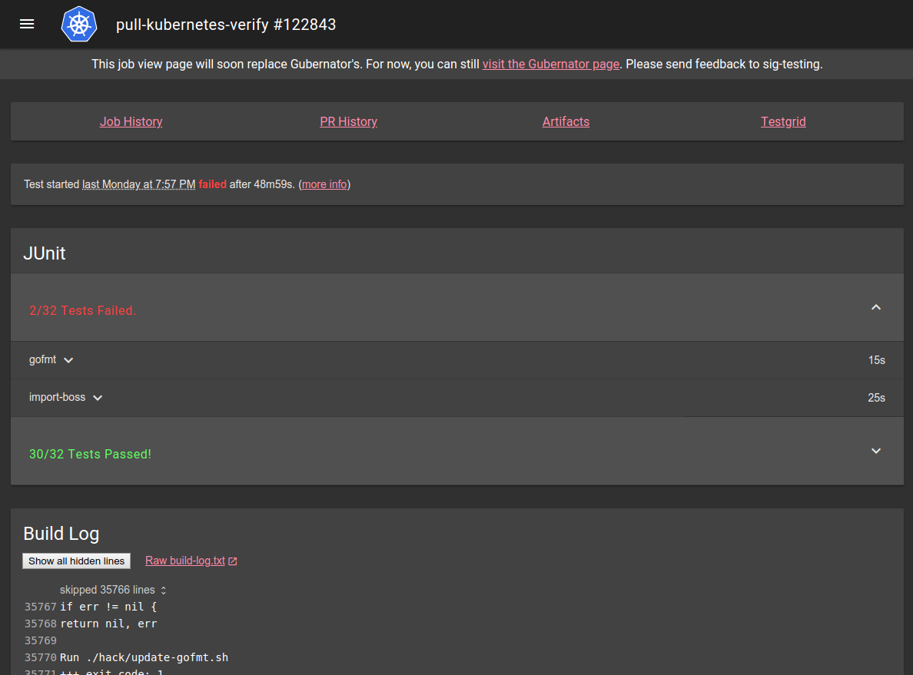

[![GoDoc Widget]][GoDoc]

# Spyglass
A spyglass is an lensed monocular maritime instrument used to see things that may have been
difficult to see otherwise.

Spyglass is a pluggable artifact viewer framework for [Prow](..) and a crude
metaphor for the real object. It collects artifacts (usually files in a storage
bucket) from various sources and distributes them to registered viewers, which
are responsible for consuming them and rendering a view.

A typical Spyglass page might look something like this:


A general Spyglass query will proceed as follows:
- User provides a job source in the query (usually a job name and build ID).
- Spyglass finds all artifact names associated with the given job source.
- Spyglass builds a cache of which artifacts match which lenses via
  configured regular expressions.
- Lenses with matching artifacts are pre-rendered in order of descending
  priority.
- Spyglass then sends render requests to each registered lens with its
  matching artifacts.
- Each lens performs any necessary operations on the artifacts and produces
  a blob of HTML.
- Views (HTML) are inserted asynchronously as viewers return.


## Lenses
A lens is an set of functions that consume a list of artifacts and produces some
HTML.

Lens names are unique, and must much the package name for the lens.


### Built-in Viewers
Spyglass comes with some built-in viewers for commonly produced artifacts.

- Prow Metadata  
  ```
  Name: metadata
  Title: Metadata
  Match: finished.json|started.json
  Priority: 0
  ```
- JUnit  
  ```
  Name: junit
  Title: JUnit
  Matches: artifacts/junit.*\.xml
  Priority: 5
  ```
- Logs  
  ```
  Name: buildlog
  Title: Build Log
  Matches: build-log.txt|pod-log
  Priority: 10
  ```

### Building your own viewer
Building a viewer consists of three main steps.

#### Write Boilerplate
First, create a package `lensnamehere` under `prow/spyglass/lenses` and
import the `lenses` package.

#### Implement
Next, implement the necessary functions for a viewer. More specifically,
implement the following interface (defined in lenses.go):
```go
type Lens interface {
    // Name returns the name of your lens (which must match the name of the directory it lives in)
	Name() string
	// Title returns a human-readable title for your lens.
	Title() string
	// Priority returns a number that is used to determine the ordering of your lens (lower is more important)
	Priority() int
	// Header is used to inject content into the lens's <head>. It will only ever be called once per load.
	Header(artifacts []Artifact, resourceDir string) string
	// Body is used to generate the contents of the lens's <body>. It will initially be called with empty data, but
	// the lens front-end code may choose to re-render itself with custom data.
	Body(artifacts []Artifact, resourceDir string, data string) string
	// Callback is used for the viewer to exchange arbitrary data with the frontend. It is called with lens-specified
	// data, and returns data to be passed to the lens. JSON encoding is recommended in both directions.
	Callback(artifacts []Artifact, resourceDir string, data string) string
}
```

In the `init` method, call `lenses.RegisterLens()` with an instance of your implementation of the interface.
Spyglass should now be aware of your lens.

Additionally, some front-end TypeScript code can be provided. Configure your BUILD.bazel to build it, then emit a
<script> tag with a relative reference to it in your `Header()` implementation. See `buildlog/BUILD.bazel` for an
example.

In your typescript code, a global `spyglass` object will be available, providing the following interface:

```ts
export interface Spyglass {
  /**
   * Replaces the lens display with a new server-rendered page.
   * The returned promise will be resolved once the page has been updated.
   */
  updatePage(data: string): Promise<void>;
  /**
   * Requests that the server re-render the lens with the provided data, and
   * returns a promise that will resolve with that HTML as a string.
   *
   * This is equivalent to updatePage(), except that the displayed content is
   * not automatically changed.
   */
  requestPage(data: string): Promise<string>;
  /**
   * Sends a request to the server-side lens backend with the provided data, and
   * returns a promise that will resolve with the response as a string.
   */
  request(data: string): Promise<string>;
  /**
   * Inform Spyglass that the lens content has updated. This should be called whenever
   * the visible content changes, so Spyglass can ensure that all content is visible.
   */
  contentUpdated(): void;
}
```

#### Add to config
Finally, decide which artifacts you want your viewer to consume and create a regex that
matches these artifacts. The JUnit viewer, for example, consumes all
artifacts that match `artifacts/junit.*\.xml`.

Add a line in `prow` config under the `viewers` section of `spyglass` of the following form:
```yaml
"myartifactregexp": ["my-view-name"]
```

The next time a job is viewed that contains artifacts matched by your regexp,
your view should display.

See the [GoDoc](https://godoc.org/k8s.io/test-infra/prow/spyglass/lenses) for
more details and examples.

## Config

Spyglass is currently disabled by default. To enable it, add the `--spyglass` arg to your
[deck deployment](https://github.com/kubernetes/test-infra/blob/e9e544733854d54403aa1dfd84ca009fd9b942f0/prow/cluster/starter.yaml#L236).

Spyglass config takes the following form:
```yaml
deck:
  spyglass:
    size_limit: 500e6
    viewers:
      "started.json|finished.json": ["metadata-viewer"]
      "build-log.txt": ["build-log-viewer"]
      "artifacts/junit.*\\.xml": ["junit-viewer"] # Remember to escape your '\' in yaml strings!
```

More formally, it is a single `spyglass` object under the top-level `deck`
object that may contain fields `viewers` and `size_limit`. `viewers` is a map of `string->[]string`
where the key must be a [valid golang regular
expression](https://github.com/google/re2/wiki/Syntax) and the value is a list
of viewer names that consume the artifacts matched by the corresponding regular
expression. `size_limit` is the maximum artifact size `spyglass` will try to
read in entirety before failing.


[GoDoc]: https://godoc.org/k8s.io/test-infra/prow/spyglass
[GoDoc Widget]: https://godoc.org/k8s.io/kubernetes?status.svg
